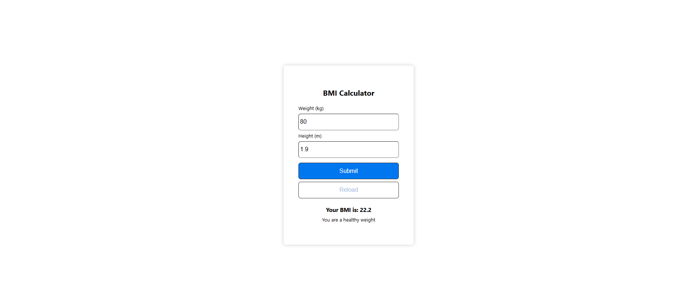

# BMI Calculator

This is a simple BMI (Body Mass Index) Calculator built using React. The app allows users to enter their weight and height, calculates their BMI, and provides a message indicating whether they are underweight, at a healthy weight, or overweight.

## Features
- **BMI Calculation**: Calculates BMI using the formula: `BMI = weight / (height * height)`.
- **User Feedback**: Displays a message based on the BMI:
  - **Underweight**: BMI less than 20
  - **Healthy weight**: BMI between 20 and 25
  - **Overweight**: BMI greater than or equal to 25
- **Reset Functionality**: Users can reset the form and reload the page with a "Reload" button.
- **Responsive Design**: The app adjusts to different screen sizes for a better user experience.

## How It Works
1. **Input**: The user enters their weight (in kg) and height (in meters) in the provided input fields.
2. **BMI Calculation**: When the user submits the form, the app calculates the BMI based on the entered data.
3. **Result**: The BMI value is displayed with a message based on the following:
   - **Underweight**: BMI is less than 20
   - **Healthy Weight**: BMI is between 20 and 25
   - **Overweight**: BMI is 25 or greater
4. **Reset**: Users can click on the "Reload" button to reset the form and input new values.

## How To Run This
1. Clone this repository in your local device
2. Install node modules
``` npm install ``` 
3. Start the App
``` npm start ```
4. it will open at local host ``` http://localhost:3000 ```

### Demo
Lets see how it will work:


## Example
- **Input**: Weight = 80 kg, Height = 1.9 m
- **Output**: Your BMI is: 22.2, You are a healthy weight.

## File Structure
Basic file structure will look like this 
```
/src 
    ├── App.css     # Styles for the main component 
    ├── App.js      # Main React component with logic 
    ├── index.css   # Global styles applied across the app 
    └── index.js    # Entry point for React application, renders App component 
/public 
└── index.html      # HTML template file
```

## Technologies Used
- **React**: For building the user interface and handling state management.
- **CSS**: For styling the application.
- **JavaScript (ES6)**: For implementing the logic and interactivity.

## Usage

1. Enter your weight in kilograms and height in meters.
2. Click on the **Submit** button to calculate your BMI.
3. Your BMI result will be displayed along with the corresponding message.
4. If you want to reset the form, click on the **Reload** button.

## Contribution

Contributions are welcome! If you'd like to improve this project, feel free to:
1. Fork the repository.
2. Create a new branch for your feature or bug fix.
3. Make your changes.
4. Submit a pull request.

## Future Enhancements

- **Unit Conversion**: Add functionality to allow users to input height in inches or weight in pounds.
- **Chart Visualization**: Display a graph or chart of BMI categories.
- **Save Data**: Allow users to save and track their BMI history.

## Contact

For any inquiries or suggestions, feel free to reach out to me at [mannatgupta146@gmail.com].

---

Happy calculating your BMI! 🚀

